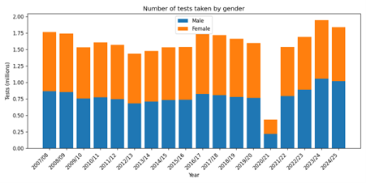

# 🚗 Driving Test Analysis

## Executive Summary

The UK Driving Test is arguably one of the most important tests undertaken in adult life. At a cost of £62 and with waiting lists of at least six months, access to testing has become increasingly constrained due to COVID-related backlogs, a shortage of examiners, and outdated booking systems.

Despite driving being a critical life skill, national pass rates have declined steadily, falling to 47.9% in 2023/24.

This project explores the drivers behind this decline by analysing factors such as gender and test trends using data spanning 18 years.

---

## 📊 Visualisations

### Chart 1

